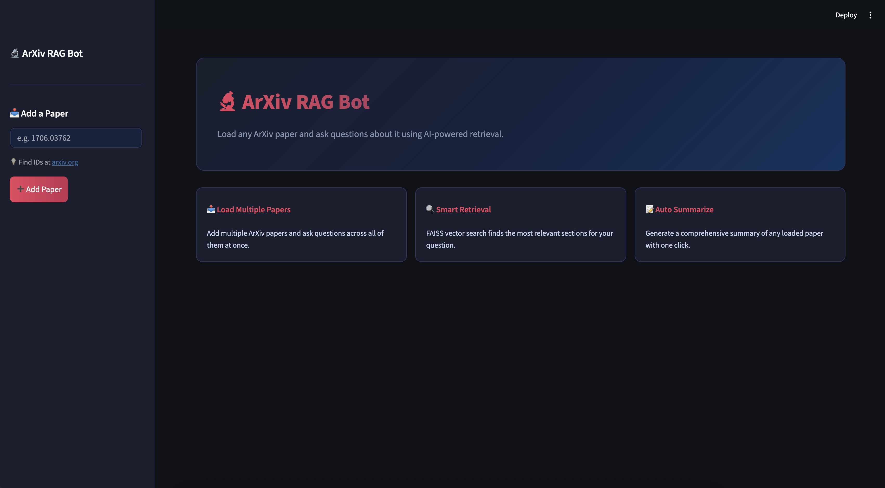
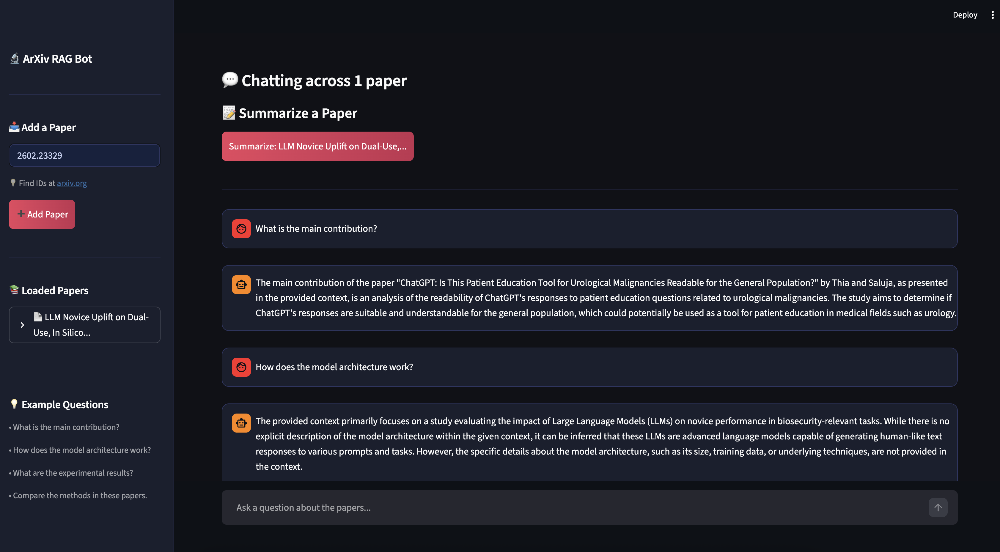
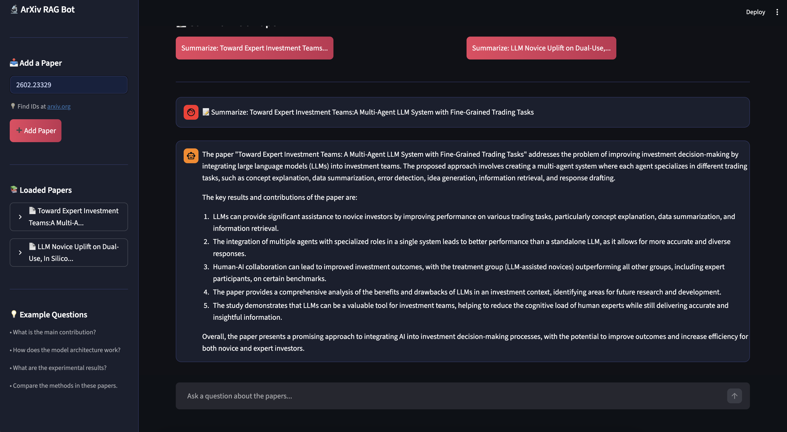

# 🔬 ArXiv RAG Bot

An AI-powered question-answering bot for ArXiv research papers, built with RAG (Retrieval-Augmented Generation), FAISS vector search, and local LLMs via Ollama.



## ✨ Features

- **Multi-paper support** — Load multiple ArXiv papers and ask questions across all of them at once
- **Smart Q&A** — Ask any question and get detailed answers grounded in the paper's content
- **Auto summarization** — Generate structured summaries with one click
- **Source transparency** — See exactly which pages and papers each answer came from
- **Fully local** — No data leaves your machine, powered by Ollama

## 📸 Screenshots

### Ask Questions


### Auto Summarize


## 🛠️ Tech Stack

| Component | Technology |
|-----------|-----------|
| RAG Pipeline | LangChain |
| Vector Search | FAISS |
| Embeddings | nomic-embed-text |
| LLM | Mistral (via Ollama) |
| Web Interface | Streamlit |
| Paper Source | ArXiv API |

## ⚙️ Installation

### Prerequisites
- Python 3.10+
- [Ollama](https://ollama.com) installed and running

### Setup
```bash
# Clone the repository
git clone https://github.com/YOUR_USERNAME/arxiv-rag-bot.git
cd arxiv-rag-bot

# Create virtual environment
python3 -m venv venv
source venv/bin/activate

# Install dependencies
pip install -r requirements.txt
```

### Pull required models
```bash
ollama pull mistral
ollama pull nomic-embed-text
```

### Run
```bash
streamlit run app.py
```

## 📖 How It Works

1. **Load** — Enter an ArXiv paper ID to download and index the PDF
2. **Chunk** — The paper is split into overlapping chunks of text
3. **Embed** — Each chunk is converted to a vector using nomic-embed-text
4. **Retrieve** — When you ask a question, FAISS finds the most similar chunks
5. **Generate** — Mistral generates a detailed answer based on the retrieved chunks

## 💡 Example Usage

Load paper `1706.03762` (Attention Is All You Need) and try:
- *What is the purpose of the attention mechanism?*
- *How does the Transformer architecture work?*
- *What are the main experimental results?*
- *Summarize this paper*

## 📁 Project Structure
```
arxiv-rag-bot/
├── app.py           # Streamlit web interface
├── ingest.py        # PDF download and vector store creation
├── rag.py           # RAG pipeline and question answering
├── requirements.txt
├── assets/          # Screenshots
└── README.md
```